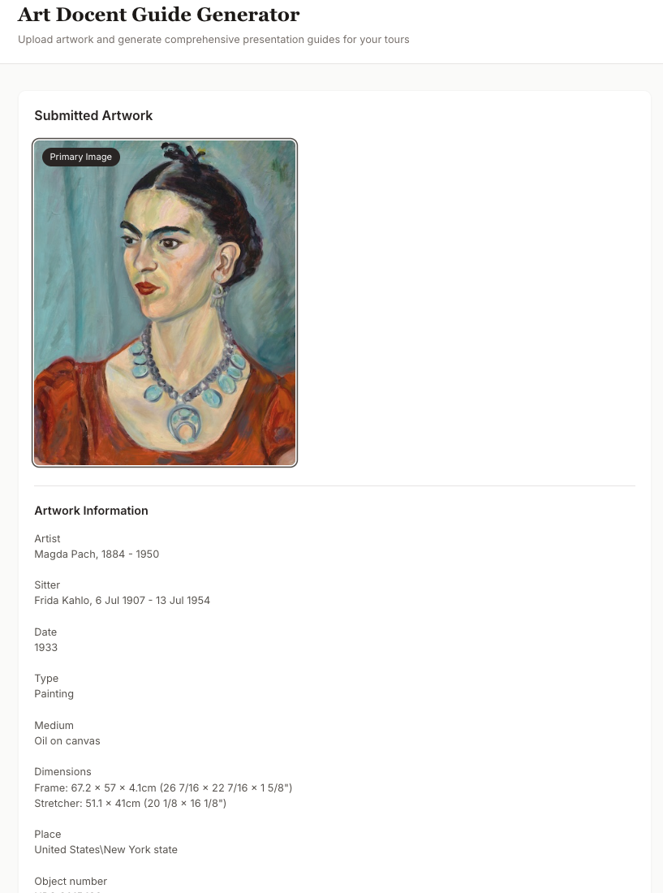
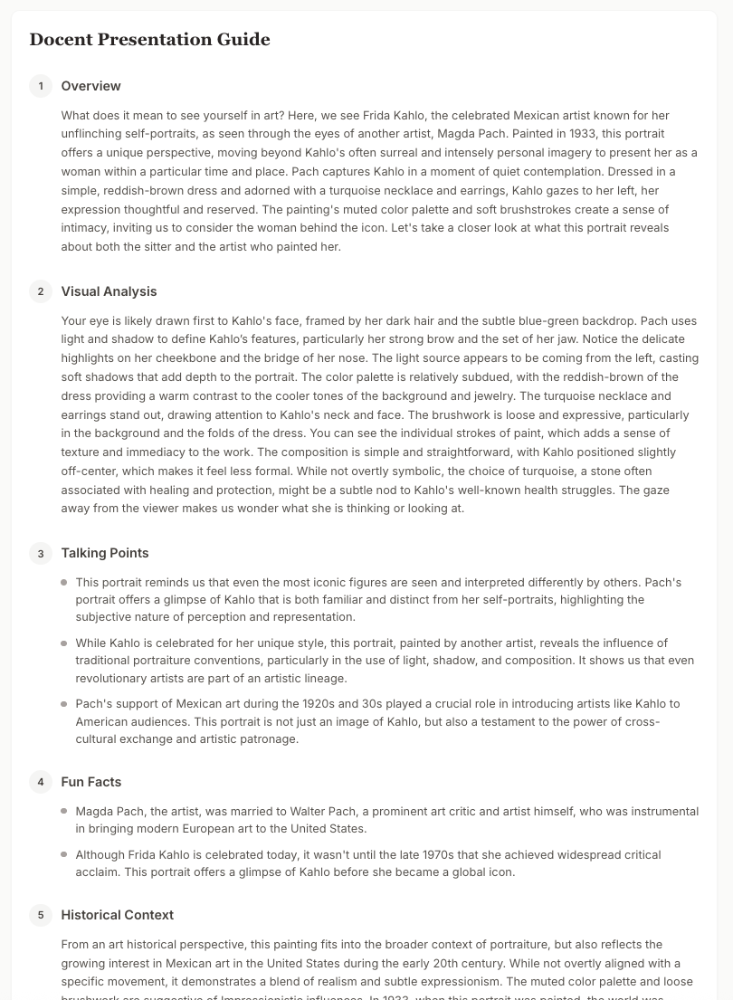

# Art Docent Guide Generator

A web application that helps art docents create comprehensive presentation guides for gallery tours. Upload artwork images and provide background information, then use Google's Gemini AI to generate engaging, audience-ready presentation materials.

## Screenshots

<a href="1.png"></a>

<a href="2.png"></a>

## Features

- **Image Upload** - Support for up to 3 images per artwork (JPEG, PNG, WebP)
- **AI-Powered Guide Generation** - Uses Google Gemini AI to create detailed presentation guides
- **Comprehensive Output** - Generates 7 sections tailored for docent tours:
  1. Overview - Vivid, engaging artwork description
  2. Visual Analysis - Systematic composition breakdown
  3. Talking Points - Compelling discussion hooks
  4. Fun Facts - Memorable artist and artwork trivia
  5. Historical Context - Art historical and world historical background
  6. Discussion Questions - Open-ended audience engagement prompts
  7. Presentation Flow - 10-minute presentation outline with stage directions
- **PDF Export** - Save guides as formatted PDF documents for offline use
- **Responsive Design** - Works on desktop and tablet devices

## Tech Stack

| Layer | Technology |
|-------|------------|
| Frontend | React 18, Vite |
| Styling | Tailwind CSS |
| Backend | Node.js, Express |
| AI | Google Gemini AI API |
| PDF | jsPDF |

## Setup

### Prerequisites

- Node.js 18+
- Google Gemini API key ([Get one here](https://makersuite.google.com/app/apikey))

### Installation

1. Clone the repository:
   ```bash
   git clone https://github.com/yourusername/Art-Docent-Guide.git
   cd Art-Docent-Guide
   ```

2. Install dependencies:
   ```bash
   npm install
   ```

3. Create a `.env` file in the root directory:
   ```
   GEMINI_API_KEY=your_api_key_here
   ```

4. Start the development server:
   ```bash
   npm start
   ```

5. Open [http://localhost:5173](http://localhost:5173) in your browser.

## Usage

1. **Upload Images** - Drag and drop or click to upload up to 3 artwork images. The first image is used as the primary image for AI analysis.

2. **Add Information** - Enter artwork details including title, artist, date, medium, and any additional context or talking points you want incorporated.

3. **Generate Guide** - Click "Generate Guide" and wait for the AI to create your presentation materials.

4. **Review & Export** - Review the generated guide and click "Save as PDF" to download a formatted document for your tour.

## Project Structure

```
art-docent-guide/
├── src/
│   ├── components/
│   │   ├── ImageUploader.jsx
│   │   ├── TextInputForm.jsx
│   │   ├── SubmissionPreview.jsx
│   │   ├── GeneratedGuide.jsx
│   │   └── LoadingSpinner.jsx
│   ├── services/
│   │   ├── geminiService.js
│   │   └── pdfService.js
│   ├── App.jsx
│   ├── main.jsx
│   └── index.css
├── server/
│   ├── index.js
│   └── routes/
│       └── generate.js
├── index.html
├── vite.config.js
├── tailwind.config.js
└── package.json
```

## Scripts

| Command | Description |
|---------|-------------|
| `npm start` | Run both frontend and backend concurrently |
| `npm run dev` | Run Vite development server only |
| `npm run server` | Run Express backend only |
| `npm run build` | Build for production |

## License

MIT
